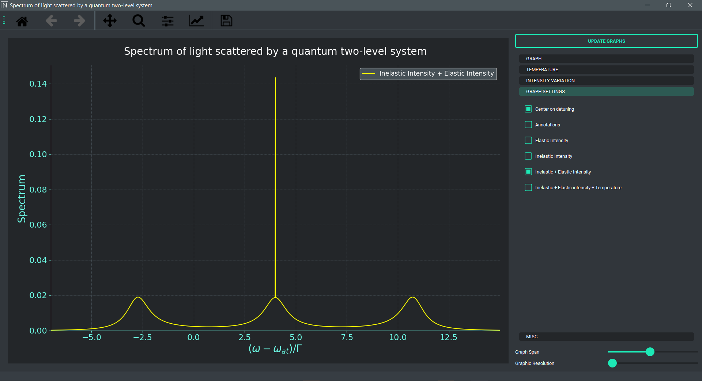

<!-- Improved compatibility of back to top link: See: https://github.com/othneildrew/Best-README-Template/pull/73 -->
<a name="readme-top"></a>
<!--
*** Thanks for checking out the Best-README-Template. If you have a suggestion
*** that would make this better, please fork the repo and create a pull request
*** or simply open an issue with the tag "enhancement".
*** Don't forget to give the project a star!
*** Thanks again! Now go create something AMAZING! :D
-->


<!-- PROJECT SHIELDS -->
<!--
*** I'm using markdown "reference style" links for readability.
*** Reference links are enclosed in brackets [ ] instead of parentheses ( ).
*** See the bottom of this document for the declaration of the reference variables
*** for contributors-url, forks-url, etc. This is an optional, concise syntax you may use.
*** https://www.markdownguide.org/basic-syntax/#reference-style-links
-->
[![Contributors][contributors-shield]][contributors-url]
[![Forks][forks-shield]][forks-url]
[![Stargazers][stars-shield]][stars-url]
[![Issues][issues-shield]][issues-url]
[![MIT License][license-shield]][license-url]
[![LinkedIn][linkedin-shield]][linkedin-url]


<!-- PROJECT LOGO -->
<br />
<div align="center">
  <a href="https://github.com/Apoorva64/spectrum-of-light-scattered-by-a-two-level-system">
    
  </a>

<h3 align="center">Spectrum of light scattered by a two level system</h3>

  <p align="center">
    This is a project to visualize the spectrum of light scattered by a two level system using python.
    <br />
    <a href="https://github.com/Apoorva64/spectrum-of-light-scattered-by-a-two-level-system"><strong>Explore the docs »</strong></a>
    <br />
    <br />
    <a href="https://github.com/Apoorva64/spectrum-of-light-scattered-by-a-two-level-system">View Demo</a>
    ·
    <a href="https://github.com/Apoorva64/spectrum-of-light-scattered-by-a-two-level-system/issues">Report Bug</a>
    ·
    <a href="https://github.com/Apoorva64/spectrum-of-light-scattered-by-a-two-level-system/issues">Request Feature</a>
  </p>
</div>


<!-- TABLE OF CONTENTS -->
<details>
  <summary>Table of Contents</summary>
  <ol>
    <li>
      <a href="#about-the-project">About The Project</a>
      <ul>
        <li><a href="#built-with">Built With</a></li>
      </ul>
    </li>
    <li>
      <a href="#getting-started">Getting Started</a>
      <ul>
        <li><a href="#prerequisites">Prerequisites</a></li>
        <li><a href="#installation">Installation</a></li>
      </ul>
    </li>
    <li><a href="#usage">Usage</a></li>
    <li><a href="#contributing">Contributing</a></li>
    <li><a href="#license">License</a></li>
    <li><a href="#contact">Contact</a></li>
  </ol>
</details>


<!-- ABOUT THE PROJECT -->

## About The Project

This is the project of my internship at INPHYNI.

The objective of this internship is to study the experimental data obtained on our experiment of atoms
cold for inelastically scattered light. I had to develop an interface
allowing to plot the theoretically expected spectra, including the various experimental parameters
important and which can be varied easily. The objective here is to be able to study graphically
the impact of the various parameters of the experiment.

All the theoretical formulas used in this app are available in the
following [paper](https://tel.archives-ouvertes.fr/tel-00007793/document).
<p align="right">(<a href="#readme-top">back to top</a>)</p>

### Built With

* [Python](https://www.python.org/)
* [PyQt5](https://pypi.org/project/PyQt5/)
* [Matplotlib](https://matplotlib.org/)
* [Numpy](https://numpy.org/)
* [Scipy](https://www.scipy.org/)

<p align="right">(<a href="#readme-top">back to top</a>)</p>


<!-- GETTING STARTED -->

## Getting Started

This is an example of how you may give instructions on setting up your project locally.
To get a local copy up and running follow these simple example steps.

### Installation

1. Clone the repo
   ```sh
   git clone https://github.com/Apoorva64/spectrum-of-light-scattered-by-a-two-level-system.git
   ```
2. Launch the app
   ```sh
   python main.py
   ```

<p align="right">(<a href="#readme-top">back to top</a>)</p>


<!-- USAGE EXAMPLES -->

## Usage

### Graphs



There is only one graph in this app. But this graph can be divided into subplots.

* Elastic Intensity
* Inelastic Intensity
* Inelastic Intensity with the elastic intensity
* Inelastic Intensity with the elastic intensity and Temperature

### Parameters


The parameters of the thesis formula are available in this app.
The parameters are auto-calculated when the graph is updated.

If you hover over the parameter, you will get a tooltip with the description of the parameter.
To update the graph, you have to click on the "Update Graphs" button.

The parameters for Temperature are available in the "Temperature" tab.
<p align="right">(<a href="#readme-top">back to top</a>)</p>

### Randomness


The randomness is available in the "Variation" tab. There it is possible to apply a random variation to the Laser
Intensity.


<!-- CONTRIBUTING -->

## Contributing

Contributions are what make the open source community such an amazing place to learn, inspire, and create. Any
contributions you make are **greatly appreciated**.

If you have a suggestion that would make this better, please fork the repo and create a pull request. You can also
simply open an issue with the tag "enhancement".
Don't forget to give the project a star! Thanks again!

1. Fork the Project
2. Create your Feature Branch (`git checkout -b feature/AmazingFeature`)
3. Commit your Changes (`git commit -m 'Add some AmazingFeature'`)
4. Push to the Branch (`git push origin feature/AmazingFeature`)
5. Open a Pull Request

<p align="right">(<a href="#readme-top">back to top</a>)</p>


<!-- LICENSE -->

## License

Distributed under the MIT License. See `LICENSE` for more information.

<p align="right">(<a href="#readme-top">back to top</a>)</p>


<!-- CONTACT -->

## Contact

Appadoo Apoorva Srinivas - [Linkedin](https://www.linkedin.com/in/appadoo-apoorva-srinivas-481367207/) -
apoorvaappadoo@gmail.com

Project
Link: [https://github.com/Apoorva64/spectrum-of-light-scattered-by-a-two-level-system](https://github.com/Apoorva64/spectrum-of-light-scattered-by-a-two-level-system)

<p align="right">(<a href="#readme-top">back to top</a>)</p>


<!-- MARKDOWN LINKS & IMAGES -->
<!-- https://www.markdownguide.org/basic-syntax/#reference-style-links -->

[contributors-shield]: https://img.shields.io/github/contributors/Apoorva64/spectrum-of-light-scattered-by-a-two-level-system.svg?style=for-the-badge

[contributors-url]: https://github.com/Apoorva64/spectrum-of-light-scattered-by-a-two-level-system/graphs/contributors

[forks-shield]: https://img.shields.io/github/forks/Apoorva64/spectrum-of-light-scattered-by-a-two-level-system.svg?style=for-the-badge

[forks-url]: https://github.com/Apoorva64/spectrum-of-light-scattered-by-a-two-level-system/network/members

[stars-shield]: https://img.shields.io/github/stars/Apoorva64/spectrum-of-light-scattered-by-a-two-level-system.svg?style=for-the-badge

[stars-url]: https://github.com/Apoorva64/spectrum-of-light-scattered-by-a-two-level-system/stargazers

[issues-shield]: https://img.shields.io/github/issues/Apoorva64/spectrum-of-light-scattered-by-a-two-level-system.svg?style=for-the-badge

[issues-url]: https://github.com/Apoorva64/spectrum-of-light-scattered-by-a-two-level-system/issues

[license-shield]: https://img.shields.io/github/license/Apoorva64/spectrum-of-light-scattered-by-a-two-level-system.svg?style=for-the-badge

[license-url]: https://github.com/Apoorva64/spectrum-of-light-scattered-by-a-two-level-system/blob/master/LICENSE.txt

[linkedin-shield]: https://img.shields.io/badge/-LinkedIn-black.svg?style=for-the-badge&logo=linkedin&colorB=555

[linkedin-url]: https://linkedin.com/in/linkedin_username
